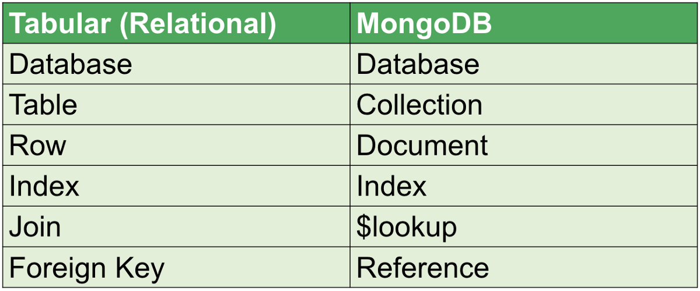

# Learn the MERN stack by building an exercise tracker

* The **MERN** stack is a popular stack of technologies for building a modern single-page application. 
* In this tutorial, you will learn the **MERN** stack by building an exercise tracker.

* The MERN stack consists of the following technologies:
1. A document-based open source database.
2. A web application framework for Node.js.
3. A JavaScript front-end library for building user interfaces.
4. JavaScript run-time environment that executes JavaScript code outside of a browser (such as a server).
* It is also common to use Mongoose, which is a simple, schema-based solution to model application data.
* We’ll be hosting our database in the cloud using MongoDB Atlas and Google Cloud Platform.

