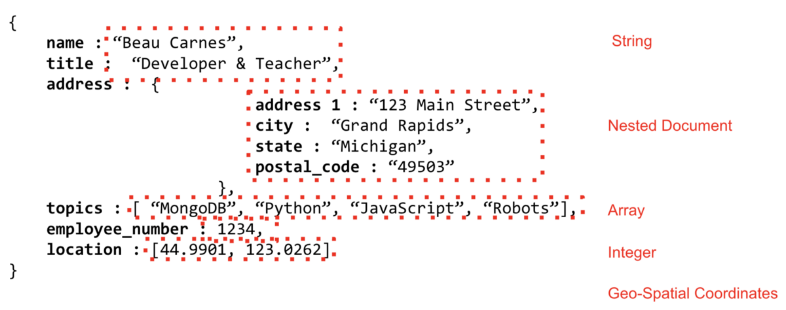

# Learn the MERN stack by building an exercise tracker
The **MERN** stack is a popular stack of technologies for building a modern single-page application. In this
tutorial, you will learn the **MERN** stack by building an exercise tracker.
The MERN stack consists of the following technologies:
: A document-based open source database.
: A web application framework for Node.js.
: A JavaScript front-end library for building user interfaces.
: JavaScript run-time environment that executes JavaScript code outside of a browser (such as a server).
It is also common to use Mongoose, which is a simple, schema-based solution to model application data.
We’ll be hosting our database in the cloud using MongoDB Atlas and Google Cloud Platform.


* In the tabular, or relational world, we think of things like databases, tables, row, etc. MongoDB has similar concepts that use different terms.
Instead of table, we have collections. Instead of rows, we have documents. We can do JOIN operations with the $lookup operator. And instead of foreign keys we utilize references.
* MongoDB is very well suited for handling data with a wide variety of relationships. Let’s have a quick look at the document model to see.


* MongoDB stores data on disk in the BSON format, or Binary JSON. This provides a wide variety of support for data types, far beyond those supported by JSON, like Decimal128, ISODates, and more.
The document model also allows for nesting documents inside each other. These sub-documents are one of the great things about the document model. It allows us to apply the concept of “Data that’s accessed together, is stored together” to our application.
* We also have the ability to store information inside arrays which is another powerful feature of the document model.
* These documents are JSON structured objects. Which is how most modern developers think of things. A person is an object that has various attributes, like a job title, address, etc.
* This allows modern development practices to use the document model in a very intuitive way without having to break the data apart to put into tables and normalize things.

## MongoDB Atlas
* You can host your MongoDB database locally but it is easier to host the database using MongoDB
Atlas.
* We will be using the free tier on MongoDB Atlas in this case. 
* The first step is to make an account at the MongoDB Atlas website.
* After you get logged in, click the green button to create a new project and then the green button to build a new cluster. The following screen shots show what the screens should look like.


* The first step to configure the new cluster is to choose your Cloud Provider, the zone or region you want your data to be stored in.
* Notice that some of the regions offer a Free Tier which is great for a sandbox environment.


* After the cluster is created, you will have to configure your security. The two things we are required to setup from a security standpoint are IP Whitelist addresses and a database user. For the IP Whitelist, just add your current IP address.


* Once those steps have been completed, we can move on and get our connection information.
* There are a few different ways that we provide information to connect to MongoDB Atlas.
1. Through the MongoDB Shell, which is a command line interface.
2. With an application connection string, which is what we’ll use.
3. Through MongoDB Compass which is a GUI tool for interacting with data stored in MongoDB.

Click the “Connect Your Application” button. You will see information on getting a connection string and then some connection examples for different languages.


* Later in the code, we will need the connection string and the password for the user that was created earlier.

## Initial set-up
1. Verify you have Node.js installed on your system by typing the following on the command line:
`node -v`
* This will show what version of Node.js you have installed. If you do not have Node.js installed, make sure to install it before moving on.

2. Next, we’ll create the initial React project by using create-react-app. The npx command allows us to run create-
react-app without installing it first. Run this command:
`npx create-react-app mern-exercise-tracker`
* This creates a directory containing the default React project template with all dependencies installed.
3. Change into the newly created folder:
`cd mern-exercise-tracker`

4. Start the development web server by running the following command:
`npm start`
* This starts the development server for the front end of the app. But before we work more on the front end, we’ll
create the back end and connect it to MongoDB Atlas.

## Backend
* Inside the root folder (“mern-exercise-tracker”), create a new folder and change into the folder by running the following commands in the terminal:
`mkdir backend$ cd backend`
* We’ll create a package.json file inside the folder by running:
`npm init -y`
* Now we can install a few dependencies:
`npm install express cors mongoose dotenv`
* We’ve already discussed Express. It is a fast and lightweight web framework for Node.js.
* Cross-origin resource sharing **(CORS)** allows AJAX requests to skip the Same-origin policy and access resources from remote hosts. The cors package provides an Express middleware that can that can enable CORS with different options.
* And we already discussed mongoose. It makes interacting with MongoDB through Node.js simpler.
* dotenv loads environment variables from a .env file into process.env . This makes development simpler. Instead of setting environment variables on our development machine, they can be stored in a file. We’ll create the `.env` file later.
* We’ll install one final package globally. Run:
`npm install -g nodemon`
* nodemon makes development easier. It is a tool that helps develop node.js based applications by automatically restarting the node application when file changes in the directory are detected.

### Backend Server
* Time to create the backend server! Make a file named server.js inside the backend directory. In the server file, we’ll create an Express server, attach the cors and express.json middleware (since we will be sending and receiving json), and make the server listen on port 5000. The code is in the repo.
NNow we can the server by using nodemon:
`nodemon server`
* You should be able to see the server running in the terminal.
* It’s finally time to connect to our database in MongoDB Atlas. At the top of **server.js**, after the line `cont cors = requre('cors');` , add the following line to require mongoose:
`const mongoose = require(‘mongoose’);`
* Now, after the line app.use(express.json()); , add:
```diff
+ const uri = process.env.ATLAS_URI;mongoose.connect(uri, { useNewUrlParser: true, useCreateIndex: true
+ });const connection = mongoose.connection;connection.once('open', () => { console.log("MongoDB
+ database connection established successfully");})
```
* The section useNewUrlParser: true is added because the MongoDB Node.js driver rewrote the tool it uses to parse MongoDB connection strings. Because this is such a big change, they put the new connection string parser behind a flag. The section useCreateIndex: true is similar. It is to deal with MongoDB deprecating the `ensureIndex()` function.

* For the connection to work, we’ll need to add the correct ATLAS_URI
environment variable.
* In the server directory, create a file named .env . Now, we need to get the uri. This is the connection string from MongoDB Atlas that was mentioned earlier. Here is how to get back to it from the MongoDB Atlas dashboard:


* In the `.env` file, type “ATLAS_URI=” and then paste in the uri / connection string you just copied. It should look something like this:
`ATLAS_URI=mongodb+srv://mean123:<password>-91icu.gcp.mongodb.net/test?retryWrites=true`
* Replace <password> with the password you set up for your user.
* In the terminal running your server you should now see the line **“MongoDB database connection established successfully”**. You may have to restart the server first.

## Database Schema
* Next we’ll create our database schema using Mongoose. We’ll have two entities: Exercises and Users.
Inside the backend folder, create a new folder named “models”. Inside that folder create two files named exercise.model.js and user.model.js.
* You can find the code for this in the repo.
* The User Schema only contains a single field: __username__. We added some validations to the username field. It is `required`, it must be `unique`, and it must be `at least 3 characters` long. Also, white space is trimmed off the end.
* In the Exercise Schema, there are four fields. Since we don’t use as much validation, each fits on its own line.

 ## Server API Endpoints
 * We now need to add the API endpoint routes so the server can be used to perform CRUD operations.
* Inside the backend folder, create a new folder named `“routes”`. Inside that folder create two files named `exercises.js` and `users.js.`
* Toward the end of `server.js`, right before the line `app.listen(port, function() { ,` add:
```diff
+const exercisesRouter = require('./routes/exercises');const usersRouter =
+require('./routes/users');app.use('/exercises', exercisesRouter);app.use('/users', usersRouter);
```
* The first two lines load the routers from other files. Then the routers are added as middleware.
* The server URL is https://localhost:5000 . Now if you add “/exercises” or “/users” on the end it will load the endpoints defined in the corresponding router files. So let’s build out those router files.
* The first endpoint handles incoming HTTP GET requests on the /users/ URL path. We call Users.find() to get a list of all the users from the database. The find method returns a promise. The results are returned in JSON format with res.json(users) .
* The second endpoint handles incoming HTTP POST requests on the /users/add/ URL path. The new username is part of the request body. 
* After getting the username, we create a new instance of User. Finally, the new user is
saved to the database with the save() method and we return “User added!”
Add these same two endpoints to “exercises.js”. You will notice that this time we break out all four fields from the submitted data.

